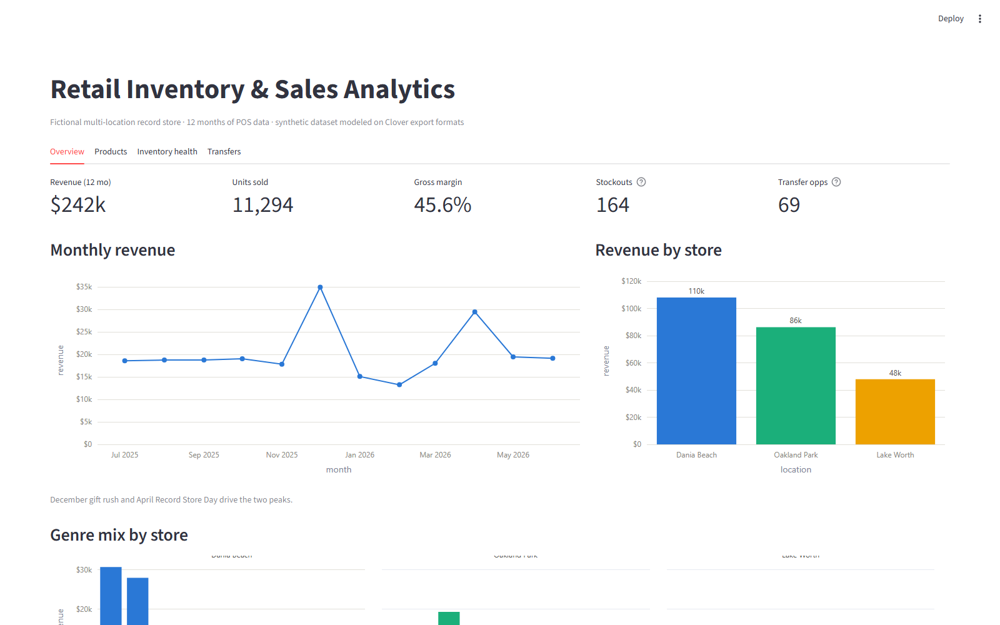
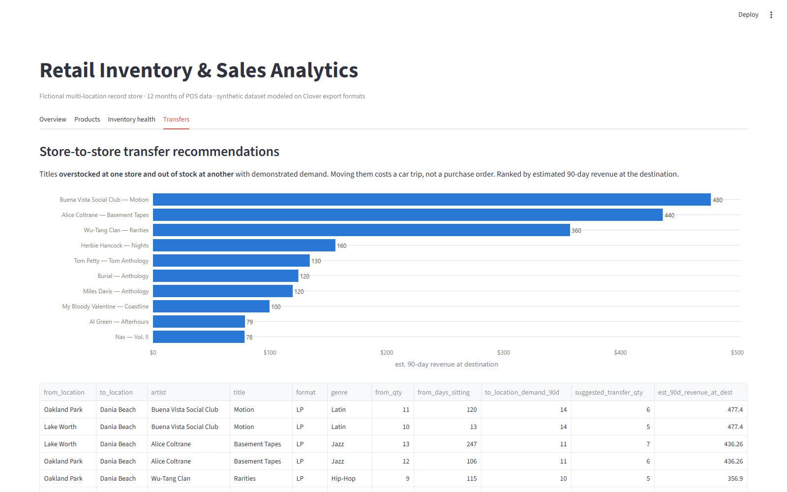

# Retail Inventory & Sales Analytics

End-to-end analytics for a fictional multi-location record store: a Python ETL pipeline, SQL analysis suite, and interactive dashboard built to answer one operations question —

> **Which products are selling, which are sitting too long, and what inventory should be transferred between locations?**



## The business problem

A record store chain with three South Florida locations has a common retail problem: inventory decisions are made store-by-store, but demand is not the same store-to-store. Titles pile up at one location while another location sells out of the same product and loses sales. This project builds the full analytics path from messy point-of-sale exports to concrete, ranked recommendations.

## Key findings

Full write-up in [reports/executive_summary.md](reports/executive_summary.md).

1. **Used inventory is the margin engine** — 61.8% gross margin vs. 39.0% for new stock, consistent across every format.
2. **Demand is local** — Jazz and Latin account for 54% of revenue at the lead store, roughly double their share elsewhere; allocation should follow store-level demand.
3. **~$3,300 of 90-day revenue is sitting in the wrong building** — 56 titles are overstocked at one store while stocked out at another with demonstrated demand. Recovering it costs a car trip, not a purchase order.
4. **One unit in five is shelf furniture** — 19.1% of on-hand units have sat 90+ days.
5. **164 stockouts have recent demand** — lost-sale risks that transfers and reorder-level review can mostly eliminate without new spend.

## How it works

```
raw POS exports (messy)          data/raw/        <- generated: duplicates, mixed date
        |                                            formats, casing drift, $-prefixes,
        v                                            missing values
python cleaning pipeline         src/clean_data.py
        |                        every correction counted in
        |                        reports/data_quality_report.md
        v
SQLite database                  src/load_db.py + sql/create_tables.sql
        |
        v
SQL analysis suite               sql/*.sql — 14 named queries executed by
        |                        src/run_analysis.py -> reports/analysis/*.csv
        v
Streamlit dashboard              dashboard/streamlit_app.py — reads the same
                                 named queries, so views and exports never drift
```

The dataset is **synthetic and reproducible** (seeded generator, `src/generate_sample_data.py`), modeled on Clover POS export formats. No real business data appears in this repository.

## The analyses

| Analysis | Question it answers |
|---|---|
| Sales performance | Revenue/units by month, store, genre — where does money come from? |
| Product performance | Top 15 heroes; dead stock with cost tied up |
| Inventory health | Overstock piles, stockouts with demand, shelf-age distribution |
| **Transfer recommendations** | What should move between stores, ranked by destination demand |
| Gross margin | Used vs. new, by format and genre |
| Sell-through | How fast stock converts to sales, by genre and store |

## Dashboard

Four views: Overview (KPIs, trend, store/genre mix), Products, Inventory health, and Transfers.



More screenshots: [products](reports/dashboard_screenshots/products.png) · [inventory health](reports/dashboard_screenshots/inventory_health.png)

## Run it

```bash
python -m venv .venv
.venv\Scripts\activate            # Windows (source .venv/bin/activate on mac/linux)
pip install -r requirements.txt

python src/generate_sample_data.py   # build raw (messy) data — seeded
python src/clean_data.py             # clean it + write the quality report
python src/load_db.py                # build SQLite db
python src/run_analysis.py           # run all 14 queries, export results

streamlit run dashboard/streamlit_app.py
```

## Stack

Python (pandas) · SQLite · Streamlit · Plotly

---

*Misael Concepcion · [github.com/mjconcepcion](https://github.com/mjconcepcion) · [linkedin.com/in/misael-j-concepcion](https://www.linkedin.com/in/misael-j-concepcion/) · misael.j.concepcion@gmail.com*
